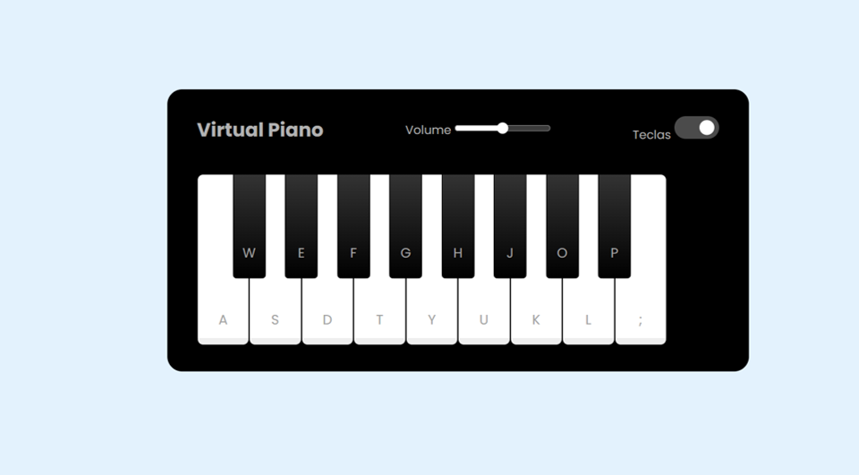

<h1 aling= "center">🎮 PIANO VIRTUAL</h1>

Um piano virtual é um software ou aplicativo que simula o som e as teclas de um piano real.

Ele pode ser tocado usando o teclado do computador, um touchscreen ou um controlador MIDI, 

permitindo praticar, compor ou se divertir sem a necessidade de um piano físico.!

<h1 aling= "center">🛠️ Tecnologias utilizadas</h1>

<ul>
  <li><b>Html:</b> criação do corpo da página</li> 
  <li><b>CSS:</b> Estilização do cenário e área de gameplay</li>
  <li><b>JavaScript:</b> programar os movimentação do jogo</li>
</ul>

<h1 >💡 Habilidades desenvolvidas</h1> 
<ul>
  <li>Manipulação de Dom</li>
  <li>Como lidar com error em JS e HTML</li>
  <li>Como trablhar com AdventLister</li>
  <li>Como estilizar elementos visuais</li>
</ul>

<h1> Site do jogo </h1>
    

 Para quem deseja jogar o jogo Detona Halph está disponivel neste site.

https://duarte-arthur21.github.io/musical-keyboard-virtual/
